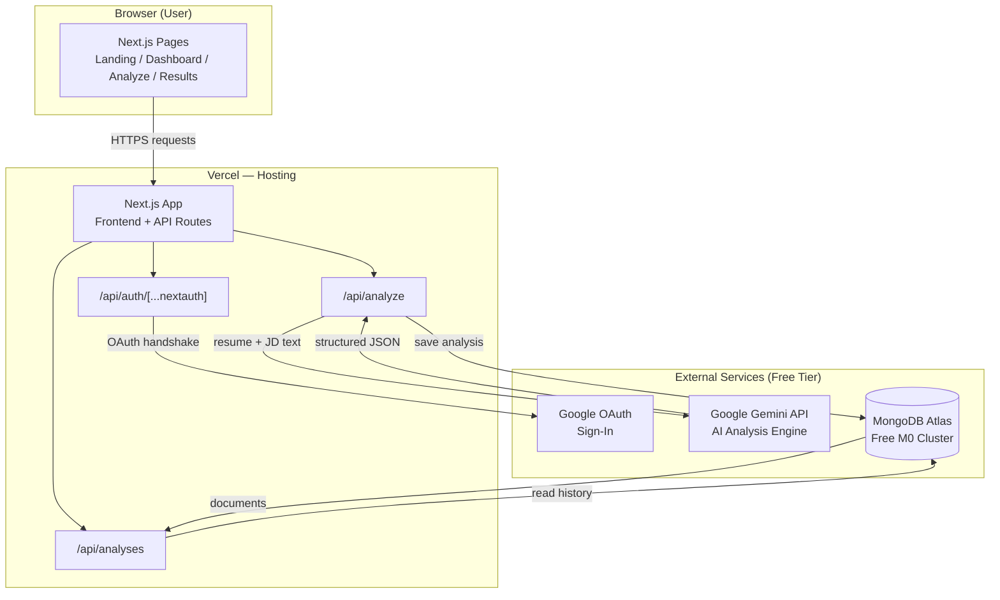
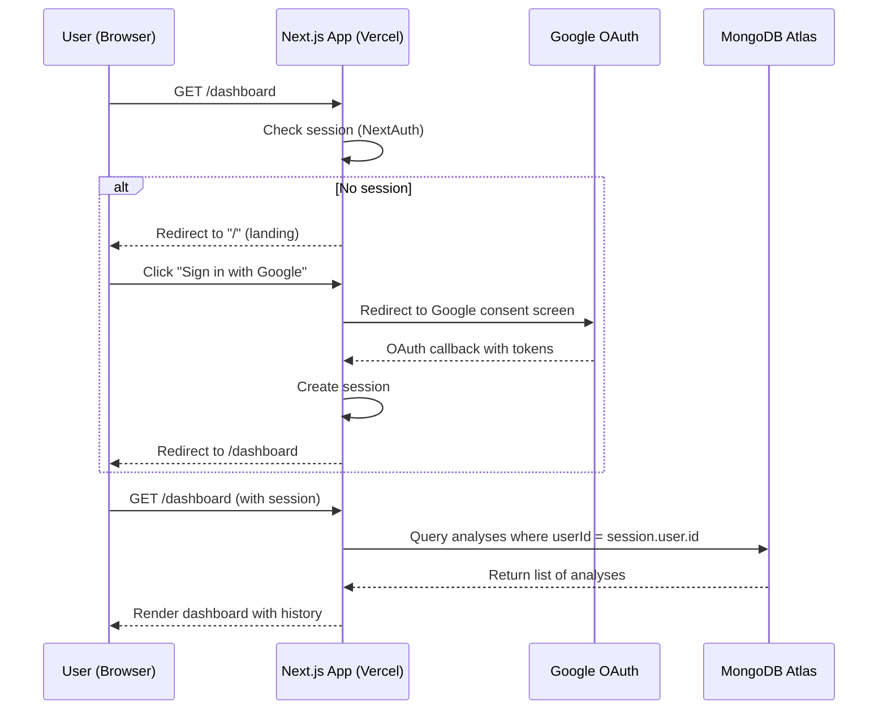
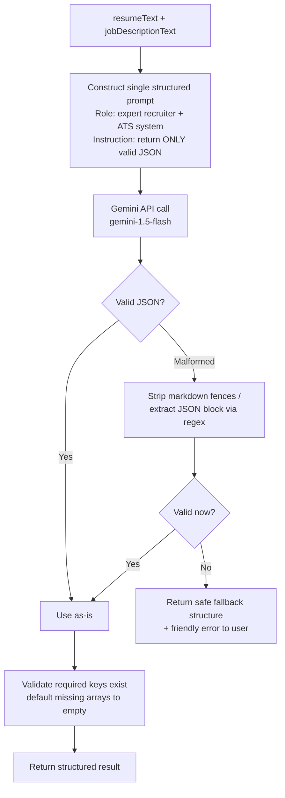
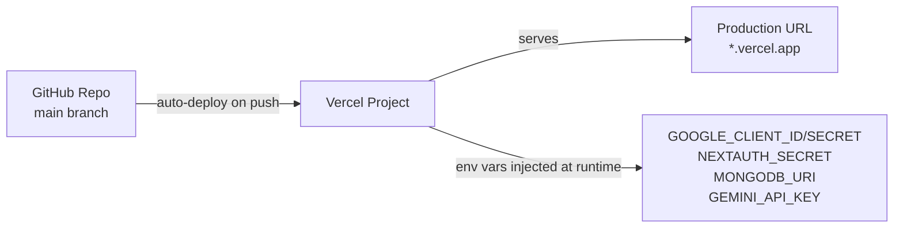

# ARCHITECTURE.md — AI Job-Fit Matcher

## 1. Component Diagram

**Notes:**
- Frontend and backend are the same deployed unit (Next.js on Vercel) — no separate backend hosting.
- All three external dependencies (Google OAuth, Gemini API, MongoDB Atlas) are free-tier cloud services; nothing is self-hosted.

---

## 2. Data Flow — Core Analysis Feature

```mermaid
flowchart LR
    A[User uploads resume<br/>+ pastes job description] --> B[Client-side validation<br/>file type / size / JD length]
    B --> C["POST /api/analyze<br/>(multipart form-data)"]
    C --> D[Extract text from resume<br/>pdf-parse or mammoth]
    D --> E[Build AI prompt<br/>resume text + JD text]
    E --> F[Call Gemini API]
    F --> G[Parse + validate<br/>structured JSON response]
    G --> H[Save Analysis document<br/>to MongoDB, linked to userId]
    H --> I[Return analysis _id to client]
    I --> J[Redirect to /results/id]
    J --> K[Fetch saved analysis<br/>GET /api/analyses/id]
    K --> L[Render Fit Score + ATS Report]
```

---

## 3. Request Lifecycle — Authenticated Page Load

---

## 4. AI Interaction Detail

**Single AI call produces both outputs** (Job-Fit Analysis + ATS Report) to minimize latency and free-tier API usage — this was a deliberate Day 1 decision, confirmed still correct.

---

## 5. External Services Summary

| Service | Purpose | Free Tier Limit Awareness |
|---|---|---|
| Google Cloud Console (OAuth) | Sign-in identity | Free, no practical limit for this scale |
| Google Gemini API | AI Job-Fit + ATS analysis | Free tier has per-minute/per-day request caps — acceptable for demo/dev use, noted as a scaling risk for Future Scope |
| MongoDB Atlas | Persistent storage (users' analyses) | M0 free cluster: 512MB storage — far more than v1.0 needs |
| Vercel | Hosting (frontend + serverless API) | Free Hobby tier: sufficient for a personal/demo-scale app |

---

## 6. Deployment Topology

No changes to this topology are anticipated between now and Day 7 deployment.
