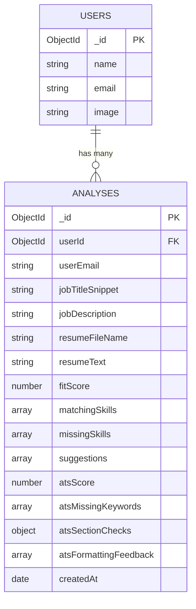

# SCHEMA.md — AI Job-Fit Matcher (MongoDB Atlas)

## Design Approach

MongoDB (document-based) was chosen over a relational DB because the AI's output is naturally variable-length and nested (arrays of skills, nested section-check objects) — a document model avoids unnecessary join tables for what is fundamentally a "one owner → many self-contained analysis records" relationship.

**Two collections are needed for v1.0:** `users` (managed automatically by NextAuth) and `analyses` (our custom data).

---

## Collection 1: `users`

Managed by NextAuth.js's MongoDB adapter — we do not hand-write this schema, but document its shape for reference since `analyses` references it.

| Field | Type | Notes |
|---|---|---|
| `_id` | ObjectId | Auto-generated |
| `name` | String | From Google profile |
| `email` | String | From Google profile — unique |
| `image` | String | Google profile photo URL |
| `emailVerified` | Date/null | Managed by NextAuth |

*(NextAuth also manages `accounts` and `sessions` collections automatically — not modeled here as they require no custom logic.)*

---

## Collection 2: `analyses`

### Field-Level Definition

| Field | Type | Required | Description |
|---|---|---|---|
| `_id` | ObjectId | auto | Primary key |
| `userId` | ObjectId (ref: `users._id`) | ✅ | Owner of this analysis — used for all authorization checks |
| `userEmail` | String | ✅ | Denormalized for convenience/debugging (avoids a join for simple display) |
| `jobTitleSnippet` | String | ✅ | First ~60 characters of the pasted JD, used as a display label on the dashboard |
| `jobDescription` | String | ✅ | Full pasted job description text |
| `resumeFileName` | String | ✅ | Original uploaded file name (display only) |
| `resumeText` | String | ✅ | Extracted plain text from the resume (stored so history can be re-viewed without re-uploading) |
| `fitScore` | Number (0–100) | ✅ | AI-generated overall match score |
| `matchingSkills` | Array\<String\> | ✅ (default `[]`) | Skills found in both resume and JD |
| `missingSkills` | Array\<String\> | ✅ (default `[]`) | Skills in JD but not resume |
| `suggestions` | Array\<String\> | ✅ (default `[]`) | Actionable improvement suggestions |
| `atsScore` | Number (0–100) | ✅ | ATS compatibility score |
| `atsMissingKeywords` | Array\<String\> | ✅ (default `[]`) | Important JD keywords missing from resume |
| `atsSectionChecks` | Object | ✅ | `{ contactInfo: Boolean, experience: Boolean, education: Boolean, skills: Boolean }` |
| `atsFormattingFeedback` | Array\<String\> | ✅ (default `[]`) | Formatting issues that could confuse ATS parsers |
| `createdAt` | Date | ✅ (default `Date.now`) | Used for dashboard sort order |

### Constraints & Validation (enforced via Mongoose schema)

- `userId` — required, indexed (all dashboard/history queries filter by this)
- `fitScore`, `atsScore` — required, Number, min `0`, max `100`
- `jobDescription` — required, minimum length validation (e.g., 50 characters) mirrors the frontend's minimum-JD-length rule from the PRD
- `resumeFileName` — required, must end in `.pdf` or `.docx` (defense-in-depth alongside frontend validation)
- Arrays default to `[]` rather than being allowed to be `undefined`, so the UI never has to null-check them

### Indexes

| Index | Purpose |
|---|---|
| `{ userId: 1, createdAt: -1 }` | Fast dashboard query: "all analyses for this user, newest first" |

---

## Validation Against PRD User Stories

| User Story (from PRD) | Schema Support |
|---|---|
| Sign in with Google | Handled by NextAuth's `users`/`accounts`/`sessions` collections — no custom fields needed |
| Upload resume, paste JD, get Job-Fit Analysis | `jobDescription`, `resumeFileName`, `resumeText`, `fitScore`, `matchingSkills`, `missingSkills`, `suggestions` |
| Get ATS Compatibility Report alongside Job-Fit | `atsScore`, `atsMissingKeywords`, `atsSectionChecks`, `atsFormattingFeedback` |
| Dashboard shows history, newest first | `userId` + `createdAt` fields + compound index |
| Reopen a past analysis | Full record retrievable by `_id`, authorization checked via `userId` match to session |
| One user cannot see another's analysis | Every query filters by `userId` derived from the server-side session — never trusts a client-supplied id alone |

✅ Every v1.0 user story from the PRD is fully supported by this schema. No gaps found — no design changes needed to the PRD or Blueprint.
