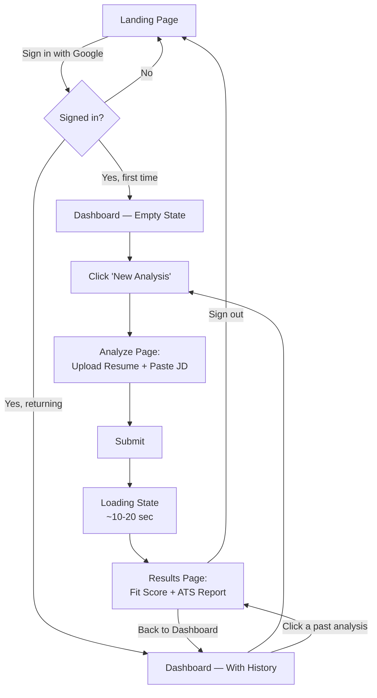
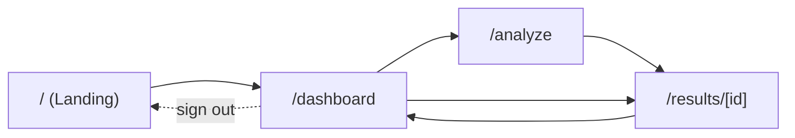

# UI-WIREFRAMES.md — AI Job-Fit Matcher

## 1. User Flow Diagram



---

## 2. Screen Flow (Navigation Map)



Every screen exists for exactly one reason:
| Screen | Reason it exists |
|---|---|
| Landing (`/`) | Entry point + sign-in — only screen accessible when signed out |
| Dashboard (`/dashboard`) | Home base after sign-in; shows history, entry point to new analysis |
| Analyze (`/analyze`) | The single input screen — upload + JD, nothing else |
| Results (`/results/[id]`) | The single output screen — shown fresh after analysis, or reopened from history |

No extra screens (settings, profile, onboarding tour, etc.) — matches PRD's lean v1.0 scope.

---

## 3. Low-Fidelity Wireframes

### 3.1 Landing Page (`/`)
```
┌──────────────────────────────────────────────┐
│  [Logo] AI Job-Fit Matcher                    │
│                                                │
│                                                │
│        Know your fit before you apply.        │
│   Upload your resume. Paste a job. Get clarity.│
│                                                │
│         [ Sign in with Google ]               │
│                                                │
│                                                │
└──────────────────────────────────────────────┘
```

### 3.2 Dashboard — Empty State (`/dashboard`)
```
┌──────────────────────────────────────────────┐
│ [Logo]      Dashboard   New Analysis  [Avatar]│
├──────────────────────────────────────────────┤
│                                                │
│         You haven't analyzed anything yet.    │
│                                                │
│           [ + Start Your First Analysis ]     │
│                                                │
└──────────────────────────────────────────────┘
```

### 3.3 Dashboard — With History (`/dashboard`)
```
┌──────────────────────────────────────────────┐
│ [Logo]      Dashboard   New Analysis  [Avatar]│
├──────────────────────────────────────────────┤
│  Your Analyses                [+ New Analysis]│
│ ┌──────────────────────────────────────────┐ │
│ │ Backend Engineer @ Acme Corp    Fit: 78% │ │
│ │ Jul 20, 2026                    ATS: 65  │ │
│ └──────────────────────────────────────────┘ │
│ ┌──────────────────────────────────────────┐ │
│ │ Frontend Dev @ Beta Inc         Fit: 54% │ │
│ │ Jul 18, 2026                    ATS: 48  │ │
│ └──────────────────────────────────────────┘ │
└──────────────────────────────────────────────┘
```

### 3.4 Analyze Page (`/analyze`)
```
┌──────────────────────────────────────────────┐
│ [Logo]      Dashboard   New Analysis  [Avatar]│
├──────────────────────────────────────────────┤
│  New Job-Fit Analysis                         │
│                                                │
│  Resume (PDF or DOCX)                         │
│  ┌────────────────────────────────────────┐  │
│  │   [ Click or drag file to upload ]      │  │
│  └────────────────────────────────────────┘  │
│                                                │
│  Job Description                              │
│  ┌────────────────────────────────────────┐  │
│  │                                          │  │
│  │  (paste job description here)           │  │
│  │                                          │  │
│  └────────────────────────────────────────┘  │
│                                                │
│              [   Analyze Fit   ]              │
└──────────────────────────────────────────────┘
```

### 3.5 Loading State (in-place on `/analyze` after submit)
```
┌──────────────────────────────────────────────┐
│                                                │
│              ⟳  Analyzing your fit...         │
│         This usually takes 10–20 seconds       │
│                                                │
└──────────────────────────────────────────────┘
```

### 3.6 Results Page (`/results/[id]`)
```
┌──────────────────────────────────────────────┐
│ [Logo]      Dashboard   New Analysis  [Avatar]│
├──────────────────────────────────────────────┤
│  Backend Engineer @ Acme Corp — Jul 20, 2026  │
│                                                │
│  ┌───────────────────┐  ┌───────────────────┐│
│  │   Job-Fit Score    │  │  ATS Compatibility││
│  │        78%         │  │      65 / 100     ││
│  │  ●●●●●●●●○○         │  │  ●●●●●●○○○○        ││
│  └───────────────────┘  └───────────────────┘│
│                                                │
│  ✅ Matching Skills                            │
│  React · Node.js · REST APIs                  │
│                                                │
│  ⚠️ Missing Skills                             │
│  GraphQL · Docker                             │
│                                                │
│  💡 Suggestions                                │
│  • Add "GraphQL" if you've used it             │
│  • Mention containerization experience         │
│                                                │
│  🔍 ATS Report                                 │
│  Missing Keywords: CI/CD, Agile                │
│  ✅ Contact Info  ✅ Experience                 │
│  ✅ Education     ❌ Skills section             │
│  Formatting: Avoid multi-column layouts        │
│                                                │
│           [ ← Back to Dashboard ]             │
└──────────────────────────────────────────────┘
```

---

## 4. Navigation Rules

- Navbar (Dashboard / New Analysis / Avatar-Sign Out) appears on all authenticated pages, never on the landing page.
- Direct URL access to `/dashboard`, `/analyze`, or `/results/[id]` while signed out redirects to `/`.
- After a successful analysis, the app auto-redirects to `/results/[id]` — the user is never left on a blank "success" screen.

No design changes needed to the PRD or Blueprint — this wireframe set maps 1:1 to the approved v1.0 feature list.
